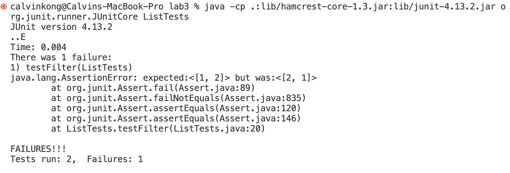

# Part 1 

Bug occurs in ListExamples filter method

## Failure Inducing Input:

```
    @Test
    public void testFilter(){

        ArrayList<String> input = new ArrayList<>();
        input.add("1");
        input.add("2");

        ArrayList<String> expected = new ArrayList<>();
        expected.add("1");
        expected.add("2");

        assertEquals(expected, ListExamples.filter(input, new SC()));

    }

```

## Input that doesn't result in a failure

```
    @Test
    public void testFilter(){

        ArrayList<String> input = new ArrayList<>();
        ArrayList<String> expected = new ArrayList<>();
        assertEquals(expected, ListExamples.filter(input, new SC()));

    }

```

## Sympton of the two tests




## Before code change 

```
  static List<String> filter(List<String> list, StringChecker sc) {
    List<String> result = new ArrayList<>();
    for(String s: list) {
      if(sc.checkString(s)) {
        result.add(0, s);
      }
    }
    return result;
  }
```

## After code change

```
  static List<String> filter(List<String> list, StringChecker sc) {
    List<String> result = new ArrayList<>();
    for(String s: list) {
      if(sc.checkString(s)) {
        result.add(s);
      }
    }
    return result;
  }

```
## Explanation

The filter method is supposed to return a new list that has all the elements of the input list for which the StringChecker returns true, and not the elements that return false, in the same order they appeared in the input list. Before the fix, the method would add all the elemnts which the string checker would return true to the front of the list and therefore would reverse the order that they appeared in the list. To fix this issue, we would change add(0,s) to add(s) which adds the value to the end of the list instead of the front and would maintain the order they appeared in the originial list.

# Part 2 

Will be using find command 

1. Find and delete a file with confirmation: 
```
find ./GFG -name sample.txt -exec rm -i {} \;
```

2. Search for empty files and directories: 
```
 find ./GFG -empty
```
3. Search for a file with specified permissions: 
```
find ./GFG -perm 664
```
4. Finds files ending in txt and then uses grep to search for the string within each of the found file's contents. 
```
find ./ -type f -name "*.txt" -exec grep 'Geek'  {} \;
```

## Options

### -type 
```
calvinkong@Calvins-MacBook-Pro technical % find . -type d       
.
./government
./government/About_LSC
./government/Env_Prot_Agen
./government/Alcohol_Problems
./government/Gen_Account_Office
./government/Post_Rate_Comm
./government/Media
./plos
./biomed
./911report
```
```
calvinkong@Calvins-MacBook-Pro 911report % find . -type f
./chapter-13.4.txt
./chapter-13.5.txt
./chapter-13.1.txt
./chapter-13.2.txt
./chapter-13.3.txt
./chapter-3.txt
./chapter-2.txt
./chapter-1.txt
./chapter-5.txt
./chapter-6.txt
./chapter-7.txt
./chapter-9.txt
./chapter-8.txt
./preface.txt
./chapter-12.txt
./chapter-10.txt
./chapter-11.txt
```
The -type option for find is used to look for paths with a certain attribute such as being a file, directory, sybolic link, etc. It is useful to narrow down your search based on the type of items you are intrested in. 

### -size

```
calvinkong@Calvins-MacBook-Pro technical % find . -size +250k
./government/Gen_Account_Office/Statements_Feb28-1997_volume.txt
./government/Gen_Account_Office/d01591sp.txt
./911report/chapter-13.4.txt
./911report/chapter-13.5.txt
./911report/chapter-3.txt
```
```
calvinkong@Calvins-MacBook-Pro technical % find . -size -500c -name "*.txt"
./experiment.txt
```

The -size option for find is used to search for paths based on their size. It is useful becasue you can filter files that match a specified size range as the user may only want to process files of a certain size. 


### -maxdepth and -mindepth
```
calvinkong@Calvins-MacBook-Pro technical % find . -maxdepth 1
.
./government
./plos
./experiment.txt
./biomed
./911report
```
```
calvinkong@Calvins-MacBook-Pro technical % find . -mindepth 5
```     

The -maxdepth and -mindepth options for find is used to specify the depth of subdirectories the find should be limited to search in. Becasue find does a recursive search throguh all the subdirectories, this option is useful for limiting it to a certain amount of subdirectories especially for large complex file systems. 

### -exec 
```
calvinkong@Calvins-MacBook-Pro technical % find . -type f -exec grep "very speci
fic" {} \;
organizations that target very specific populations or legal
requires carriers to provide a very specific geographical location
Congress should also consider several very specific criteria in
        function—but the results are very specific to the skills that are trained, and it is as yet
        influences shaped their brains to create—and to create these very specific wondrous things?
        the design of very specific primers that generate extremely
        microarray hybridisation can be very specific, the high
        outside of that very specific group of TFX-sensitive
        very specific group within the α-proteobacteria in culture
          obtained after using a very specific rabbit anti-NKB
```
```
calvinkong@Calvins-MacBook-Pro technical % find . -maxdepth 1 -type f -exec chmo
d +x {} \;
```

The -exec option for find is used to perform another command on the files or directories found from the search. It is useful because it allows you to combine multiple commands and is differnt from pipe as it executes the command on the file that matches the search criteria instead of redirecting the output of one command to the input of another. 


# Sources
https://www.geeksforgeeks.org/find-command-in-linux-with-examples/#

https://tecadmin.net/linux-find-command-with-examples/


